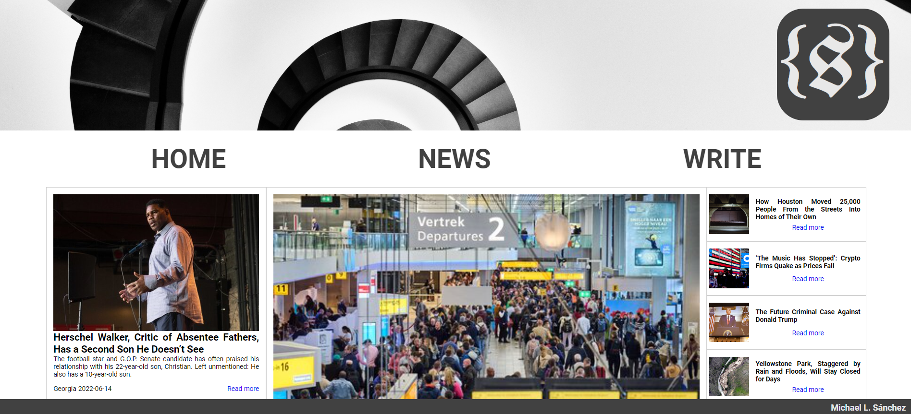

<h1 align=center>SetNews</h1>

* Sobre el proyecto

    * Tecnologías utilizadas 

    * Instalación y despliegue 

    * Origen 

    * Concepto e inspiración

* Retos presentados

    * Imagenes de la API 

    * Layout de la pagina principal

* En el tintero

* Autor

# Sobre el proyecto

## Tecnologias utilizadas


Para este proyecto hemos utilizado JavaScript y HTML con React y CSS con Sass.

## Instalación y despliegue

1. Clonar el repositorio introduciendo `git clone https://github.com/MrSetOne/SetNews.git` en la terminal.

2. Registrarse en la API de [New York Times](https://developer.nytimes.com/) y crear una aplicación con tu cuenta, la cual autorice el uso de la API [Most Popular](https://developer.nytimes.com/docs/most-popular-product/1/overview), asi obtienes la API KEY necesaria para el proximo paso. (Mas info [aquí](https://developer.nytimes.com/get-started).)

3. Dentro de la carpeta clonada existe un directorio llamado `src` que contiene el archivo `config copy.js`, cambia el nombre a `config.js` e introduce tu API KEY dentro de la variable.

4. Abre la terminal en la carpeta del repositorio y ejecuta el comando `npm i` para instalar las dependencias necesaria y `npm start` para ejecutar la aplicación.

## Origen

Este proyecto nace como un trabajo para el Bootcamp de FullStack en [The Bridge](https://www.thebridge.tech/). La idea es generar una SPA de noticias que haga solicitudes a la API de NYT y que contenga la posibilidades de generar nuevos articulos (que son almacenados en el local storage).

## Concepto e inspiración



La idea era basarme en el estilo de un periodico clasico, usando mucho la escala de grises que aportan sobriedad y ese aire a noticias de "toda la vida". Tambien se ha trabajado bastante en la responsividad para lograr que la pagina sea accesible desde practicamente cualquier dispositivo.

# Retos presentados

## Imagenes de la API

El problema surgio de que la respuesta de la API a veces venian algunos articulos sin ninguna imagen, lo cual ocasionaba que se cortara el "mapeo" de la resuesta. Adicionalmente cuando devolvia imagenes eran un array de varias de ellas, ordenadas de menor a mayor resolución, con lo cual la que nos interesaba extraer era la ultima, precisamente por su calidad. Para solucionarlo usamos el el siguiente ternary operator.

```JavaScript
        {element.media.length !== 0?
        :
        null}

```

Con esto indicamos que en el caso de que el array "media" midiese mas de 0 imprimiria una imagen cuyo src fuese la ultima imagen del array (gracias al metodo `array.length`). En el caso de que el array "media" mida 0 (es decir, esté vacio) no genera la imagen, pero si su texto.

## Layout de la pagina principal

Para lograr el estilo deseado necesitaba dos columnas principales, la principal compuesta por un grid con lo que se supone son las "principales noticias" y un aside que contiene las "noticias segundarias" con flexbox, la respuesta de la API contenia 20 items con lo que diseñé una estructura que contaba con 9 elementos en el grid principal y 11 en el aside, para lograr que esto funcionase lo que hice fue un `array.forEach()` y usando el segundo parametro de esta función (numero de iteraciones) iba almacenando los datos en un array u otro. La ejecucion fué la siguiente:

```JavaScript
...
  let printAside = []
  let printMain =[]

  news.forEach((element,i) =>{
    if(i>=9){
      const asideArticle = (
        <div className="Main__Article--aside">
            ...     
       </div>
      )
      return (
        printAside.push(asideArticle)
      )
    }else{
      const mainArticle = (
        <div className="Main__Article" key={element.id}>
            ...
        </div>
      )
      return printMain.push(mainArticle)
    }
  })
...
```

# En el tintero

- Mostrar las noticias introducidas manualmente

- Llamada a una segunda API

- Implementación de spinner

# Autor

# Michael L. Sánchez (MrSetOne) :rocket: